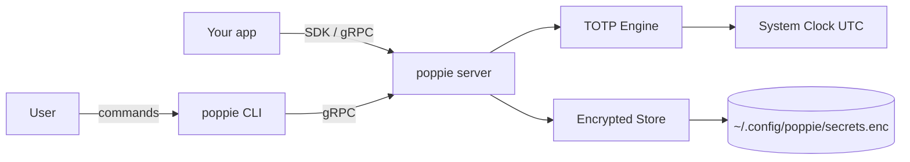

# How It Works

## Overview

Poppie has two parts: a **CLI** for human interaction and a **gRPC server** that
stays running in the background for fast programmatic access. Secrets are stored
encrypted on disk and codes are generated on demand using RFC 6238.

## Request flow

When your app calls `client.get_code("github.com")`:

1. The SDK sends a gRPC request over the Unix socket
2. The server looks up the encrypted secret for that label
3. The TOTP engine generates a code using the secret and current UTC time
4. The code is returned (sub-millisecond)

## Security model

- **At rest** — secrets are encrypted with AES-256-GCM, key derived from your passphrase via argon2id
- **In transit** — gRPC over Unix socket (no network exposure by default)
- **Access control** — Unix file permissions on the socket; only your user can connect

## gRPC API

The server exposes four RPCs:

| RPC | Description |
|-----|-------------|
| `StoreSecret` | Store a new TOTP secret |
| `GetCode` | Generate a current code for a stored secret |
| `ListSecrets` | List all stored secret labels |
| `DeleteSecret` | Remove a secret from the vault |

The [Go SDK]() and [Python SDK]() wrap
these RPCs with idiomatic APIs and automatic version negotiation.

## Version negotiation

SDKs send `x-poppie-sdk-version` and `x-poppie-sdk-name` headers on every call.
The server responds with a version status (`supported`, `deprecated`, or `unknown`)
so your app can surface upgrade warnings. See [versioning]()
for the full protocol.
