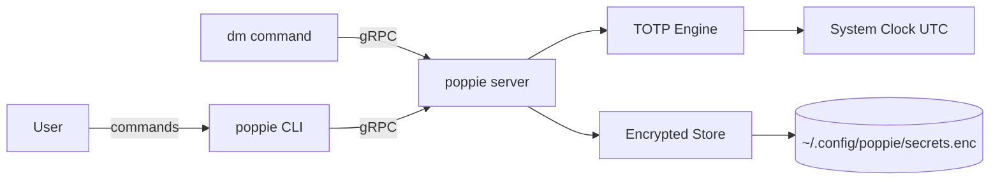

# Architecture

## Overview

Poppie is a local-first TOTP manager comprising a CLI for human interaction and a
persistent gRPC server for fast programmatic access. It stores TOTP secrets encrypted
on disk and generates RFC 6238 time-based codes on demand.

## System Diagram

## Request Flow

### Storing a secret (CLI)

1. **User** runs `poppie store --key example.com --secret JBSWY3DPEHPK3PXP`
2. **CLI** connects to the running gRPC server (or starts one)
3. **Server** validates the secret generates a test code to confirm it works
4. **Store** encrypts the secret with the user's key and writes to disk
5. **Response** confirms storage with a current code for verification

### Getting a code (programmatic)

1. **dm** connects to the poppie gRPC server via Unix socket
2. **Server** receives `GetCode(key="example.com")` request
3. **TOTP Engine** generates a code using the stored secret and current UTC time
4. **Response** returns the 6-digit code (sub-millisecond)

## Components

| Component | Location | Purpose |
|-----------|----------|---------|
| CLI | `cmd/poppie/` | Cobra-based CLI commands |
| gRPC Server | `internal/server/` | Persistent server, Unix socket + localhost |
| TOTP Engine | `internal/totp/` | RFC 6238 code generation and validation |
| Encrypted Store | `internal/store/` | Secret storage with AES-256-GCM encryption |
| Auth | `internal/auth/` | Optional JWT validation for multi-user scenarios |
| Proto Defs | `proto/` | Service and message definitions |

## Data Model

- **Secret** — a TOTP secret keyed by a label (e.g. domain name). Contains: key (string), encrypted_secret (bytes), algorithm (SHA1/SHA256/SHA512), digits (6/8), period (30s default), created_at, last_used_at.
- **Vault** — the collection of all secrets for a user, encrypted as a single file.

## Key Technical Decisions

| Decision | ADR | Summary |
|----------|-----|---------|
| No custom subagents | [ADR-001](adr/001-no-subagents.md) | CLAUDE.md + AGENTS.md over custom tooling |
| Go + gRPC | [ADR-002](adr/002-go-grpc.md) | Single binary, protobuf API, sub-ms latency |
| BDD with Cucumber | [ADR-003](adr/003-bdd-cucumber.md) | Gherkin specs drive development, godog runs them |
| Encrypted local storage | [ADR-004](adr/004-local-encrypted-storage.md) | AES-256-GCM, argon2id KDF, single file vault |

## Security

- **Authentication**: Local-only by default (Unix socket). Optional JWT for network access.
- **Authorisation**: Single-user (file permissions). Multi-user via JWT claims if needed.
- **Secrets at rest**: AES-256-GCM encryption, argon2id key derivation from user passphrase.
- **Secrets in transit**: gRPC over Unix socket (no network). TLS required for TCP connections.
- **Key material**: Never logged, never included in error messages.

## External Dependencies

| Service | Purpose | Failure Impact |
|---------|---------|----------------|
| System clock | UTC time for TOTP generation | Incorrect codes if clock skewed > 30s |
| File system | Encrypted vault storage | Cannot store/retrieve secrets |
| None (network) | Poppie is local-first | No external network dependencies |
